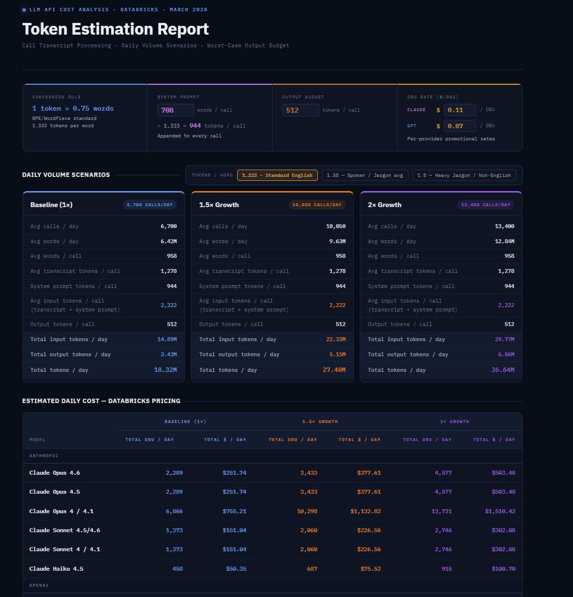

# LLM Token Estimation · Databricks Cost Analysis

A single-file interactive HTML tool for estimating daily LLM token volumes and Databricks inference costs across Anthropic and OpenAI models. No build step, no dependencies — open in a browser and go.

---

## Features

- Projects token volumes across three daily call volume scenarios (1×, 1.5×, 2×)
- Calculates total daily cost in DBU and USD per model
- Separate configurable DBU rates for Claude and GPT models
- Adjustable system prompt (word input → live token conversion), output token budget, and tokens-per-word multiplier
- Covers all current non-deprecated Claude and GPT models on Databricks Proprietary Foundation Model Serving

## Usage

```bash
open token_estimation_report.html
```

Since it's a single self-contained HTML file, you can also upload it directly to [Claude](https://claude.ai) — along with the file or a screenshot of new pricing — and ask it to update model prices, add new models, adjust defaults, or extend functionality. No code knowledge required.

## Pricing sources

- [Proprietary model pricing](https://www.databricks.com/product/pricing/proprietary-foundation-model-serving)
- [Supported models](https://docs.databricks.com/aws/en/machine-learning/foundation-model-apis/supported-models)

> Prices are indicative only — verify before budgeting.

 
